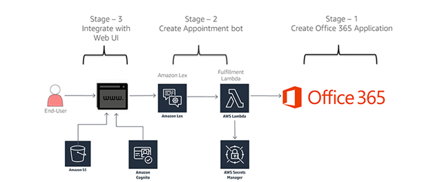

## Schedule an appointment in Office 365 using an amazon lex bot

You can use chatbots for automating tasks such as scheduling appointments to improve productivity in enterprise and small business environments. For scheduling appointments, the bot interacts with the end user to find convenient time slots and reserves a slot. In this blog post, we show how you can build the backend integration for an appointment bot with the calendar software in Microsoft Office 365 Exchange Online

## Architecture

To achieve this automation we use an AWS Lambda function to call Office 365 APIs to fulfill the Amazon Lex intent. The Office 365 secrets are securely stored in AWS Secrets Manager. The bot is integrated with a web application that is hosted on Amazon S3. Amazon Cognito  is used to authorize calls to Amazon Lex services from the web application

## Prerequisite

Follow this [blog](https://aws.amazon.com/blogs/machine-learning/schedule-an-appointment-in-office-365-using-an-amazon-lex-bot/) to deploy the solution  

## Code

The code for the lambda function used to call office 365 APIs are available [here](https://github.com/aws-samples/aws-lex-office365/tree/master/code) 

## License Summary

This sample code is made available under a modified MIT license. See the LICENSE file.
